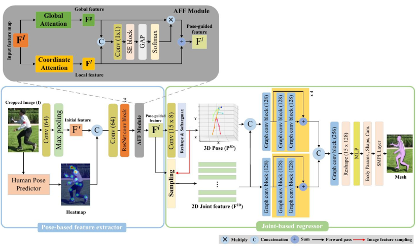
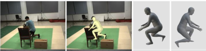
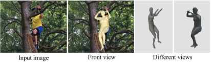

<h2 align="center">
3D Human Mesh Reconstruction in Complex Environments Based on Monocular Camera
</h2>

<h3 align="center">
    &#x1F525 Research in Computer Vision and Deep Learning
</h3>
    

    &#x1F9D1 <a href="https://github.com/MilkLoo">MilkLoo</a> &#x1F4E7 2395611610@qq.cpm

## 📌 Research Content 
The whole research content is roughly divided into two parts, one is the single human recovery, the other 
is the multi-person situation. 

### 🚀 Single human recovery in complex environments
First of all, it is necessary to explain the complex environment, including some outdoor 
and indoor cases with shelter, the established model can obtain a three-dimensional model
of the human body through a simple two-dimensional picture, and can obtain the three-dimensional
posture of the human body.
1. **Pose-based Feature Extractor:** In order to strength the feature extraction ability of
the model in complex environment, the feature extraction guided by 2D human body posture information
is added. The proposed AFF module integrates the local and global attention mechanism, making the features
extracted by the model more robust.
2. **Joint-based Regressor:** The sampled 2D and 3D key point information is used as the input of the regressor,
and the graph model implicitly uses the connection relationship between joints(prior information) to accelerate
the convergence of the model.

    

### 🚀 Multi-person situation

### Demo

* `Picture demo`

    
    

---
* `Video demo`

    

